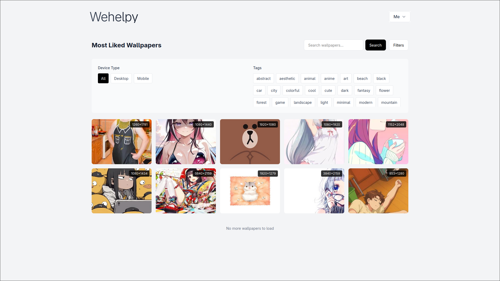
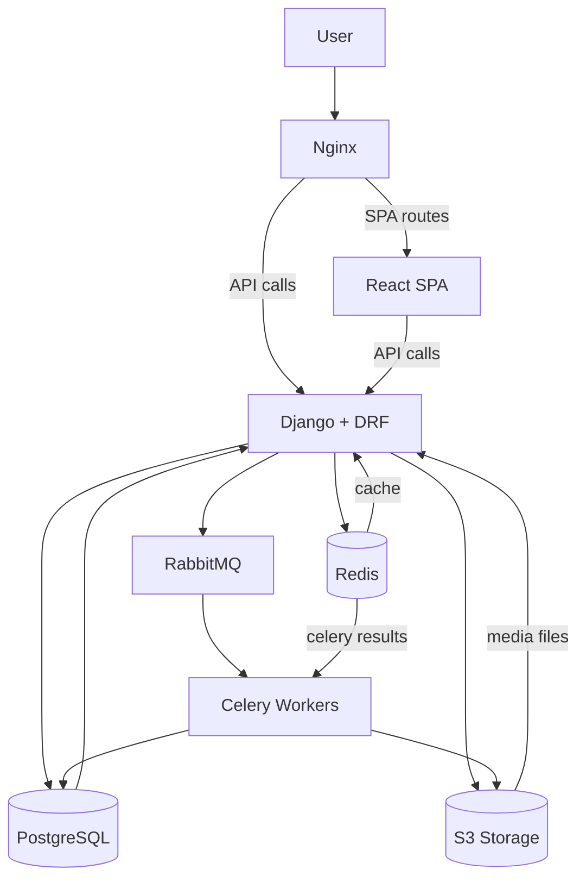

# 🖼 Wallpaper
**Wallpaper** — это полнофункциональный сервис для обмена обоями:  
пользователи могут регистрироваться, загружать изображения, ставить лайки, добавлять в закладки, использовать теги, жаловаться на неподходящий контент, а также настраивать двухфакторную аутентификацию (2FA).

**Production:** https://wallpaper.wehelpy.ru
## 📑 Содержание
- [Архитектура проекта](#-архитектура-проекта)
- [Возможности](#-возможности)
- [API Endpoints](#-api-endpoints-основное)
- [Запуск через Docker](#-запуск-через-docker-локально)
---
⚡ Backend: Django + DRF + JWT  
🎨 Frontend: React (рендерится как SPA через Django)  
🗄 Хранилище: PostgreSQL + S3 (для картинок)  
🐇 Очереди: Celery + RabbitMQ + Redis  
🚀 Деплой: Docker Compose + Gunicorn + Nginx  

---
Главная страница:


## 🏗 Архитектура проекта



## 🚀 Возможности

### 👤 Аккаунты
- Регистрация и авторизация через JWT
- Подтверждение входа (двухэтапная верификация)
- Двухфакторная аутентификация (2FA)
- Профиль пользователя с аватаром

### 🖼️ Обои
- Загрузка новых обоев (с сохранением в S3)
- Просмотр популярных обоев
- Поиск по тегам
- Лайки и закладки
- Жалобы (репорты)

### 🏷️ Теги
- Автоматическая генерация базовых тегов  
  (через кастомную команду `python manage.py create_tags`)

### 🛠️ Админка
- Управление пользователями и контентом
- Мониторинг жалоб и модерация

### 📡 API
- Swagger и Redoc документация доступны в DEBUG-режиме
- JWT аутентификация + refresh токен

---

## 📚 API Endpoints (основное)

###  Аккаунты
- `POST /api/registration/` — регистрация
- `POST /api/login/` — вход
- `POST /api/login-verification/` — проверка кода входа
- `GET /api/profile/` — профиль
- `POST /api/2fa/enable/` — включение 2FA(почта)
- `POST /api/2fa/verify/` — включение 2FA(код)

###  Обои
- `GET /api/best-wallpapers/` — лучшие обои
- `POST /api/create/` — загрузить обои
- `GET /api/tags/` — список тегов
- `GET /api/wallpapers/` — поиск по обоям
- `GET /api/wallpapers/<id>/` — детали обоев
- `POST /api/wallpapers/<id>/like/` — лайк/анлайк
- `POST /api/bookmarks/` — закладки
- `POST /api/reports/` — пожаловаться

---

## 🐳 Запуск через Docker (локально)

```bash
git clone https://github.com/slime4ik/wall.git
cd wall
docker-compose up --build
```
## Сборка статики и миграции
```bash
# статика
docker-compose run --rm web python manage.py collectstatic --noinput
# миграции
docker-compose run --rm web python manage.py migrate
